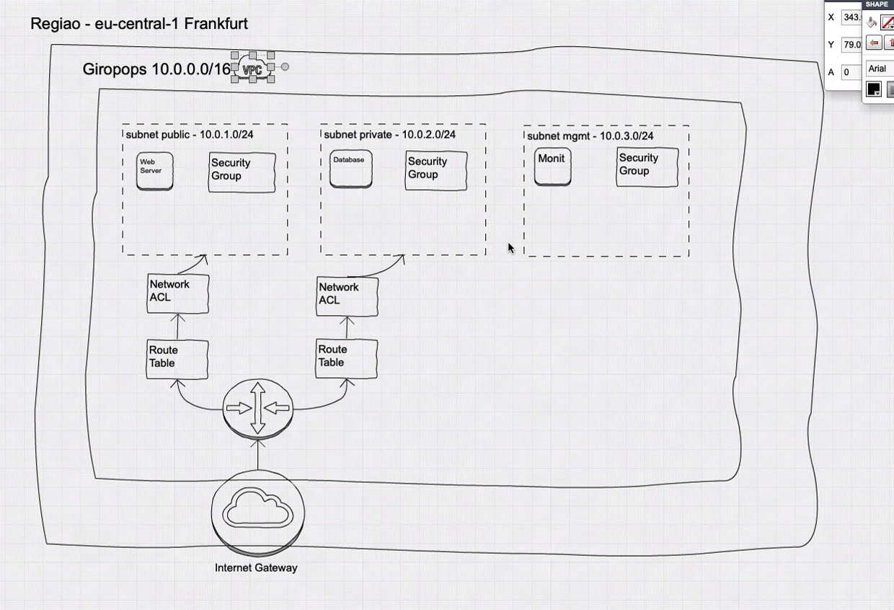

## Caracteristicas e Vantagens

- Agilidade
- Manutenção
- Confiabilidade
- Segurança
- Performance
- Escalabilidade
- Elasticidade

## Deployment models
- Private Cloud
- Public Cloud
- Hybrid Cloud
- Multicloud
- Community

## Well-Architecture
- E um formulário dentro da AWS para verificar se utiliza os padrões da aws. Focando em Pilars, Design Principles e Questions
- Os 5 pilares são:  operational excellence, security, reliability, performance efficiency, and cost optmization.

## Distribuição da AWS no Mundo

- Região
- Zona de Disponibilidade
- Zona local

## IAM (Identity & Access Management)

- **Policy**: Objeto que define os acesso aos recursos a AWS
```json
{
	"Version": "2012-10-17",
	"Statement": [
		{
			"Sid": "Statement1",
			"Effect": "Allow",
			"Action": [],
			"Resource": ["ARN"]
		}
	]
}
```
- **ARN - Amazon Resource Names**
    - arn:partition:service:region:account-id:resource-id
    - arn:partition:service:region:account-id:resource-type/resource-id
    - arn:partition:service:region:account-id:resource-type:resource-id

    - **parition**: representa em qual grupo de região a conta pertence
    - **servie**: nome do serviço que identifica o produto da AWS
    - **regiao**: cod da região
    - **account-id**: id da sua conta
    - **resource-id**: id do recurso


- **Group**: Cada grupo vai ter suas politicas de uso, facilitando agrupar e gerencias accounts e acesso.
- **Role**: Podemos permitir acesso entre serviços da aws utilizando a role


### Modelos de Serviços Resumo

- **Iaas (infrastructure as a service)**: É a disponibilidade sob demanda de recursos de computação altamente escalonáveis como serviços na Internet

- **SaaS (Software as a Service)**: Fornece aplicativos de software pela internet, eliminando a necessidade de instalação e manutenção local. Exemplos incluem Google Workspace e Microsoft Office 365.

- **PaaS (Platform as a Service)**: Oferece uma plataforma que permite aos clientes desenvolver, executar e gerenciar aplicativos sem lidar com a infraestrutura subjacente. Exemplos incluem Google App Engine e Microsoft Azure.

- **FaaS (Function as a Service)**: Permite que os usuários implantem funções ou pedaços de código que são executados em resposta a eventos, sem gerenciar servidores. Exemplos incluem AWS Lambda e Google Cloud Functions.

### Modelos de Implementação Resumo

- **Private Cloud (Nuvem Privada)**: Infraestrutura de nuvem exclusiva para uma única organização, oferecendo maior controle e segurança. Exemplos incluem data centers internos de empresas.

- **Public Cloud (Nuvem Pública)**: Serviços de nuvem fornecidos por terceiros e disponibilizados ao público pela internet. Exemplos incluem Amazon Web Services (AWS) e Google Cloud Platform (GCP).

- **Hybrid Cloud (Nuvem Híbrida)**: Combinação de nuvem privada e pública, permitindo que dados e aplicativos sejam compartilhados entre elas. Exemplos incluem a integração de data centers privados com serviços de nuvem pública.

- **Community Cloud (Nuvem Comunitária)**: Infraestrutura de nuvem compartilhada por várias organizações com interesses comuns, como requisitos de segurança ou conformidade. Exemplos incluem nuvens comunitárias para instituições governamentais ou educacionais.


## Foundation

### Master account
- Um dos problemas iniciais na criação de uma conta para subir seus projetos é a organização. Uma ideia é ter uma "root account" que gerenciará todas as demais contas.
- Conta com e-mail único.
### Organizational Unit(OU)
Podemos fazer o controle de recursos com base na organization. Por exemplo:
- Dev: utiliza apenas maquinas mais fracas, só pode usar servidores de São Paulo.

### Accounts
- Em uma conta de dev por exemplo crie um email para a equipe e não use email pessoais.


## EC2 - Elastic Compute Cloud
- Permite a criação de máquinas Windows, Linux e Mac
- Cobrança por segundo
- Pode ter acesso público ou não
- **Uso geral**: aplicação web
- **Otimizadas para computação**: aplicações que usam mais CPU
- **Otimmizada para memória**: banco redis
- **Computação acelerada**:  aplicações com calculos
- **Otimizadas pra armazenamento**: banco de dados
- **Otimizadas para alta performance**:  aplicações que fazem simulações e utilizam placa de video


## Principais Funcionalidades e Utilizações de uma VPC:


1. **Isolamento e Segurança**: A VPC oferece um ambiente isolado onde os recursos são protegidos do acesso externo não autorizado. Você pode definir regras de firewall (conhecidas como regras de segurança) e políticas de controle de acesso para controlar o tráfego de entrada e saída.

2. **Sub-redes**: Dentro de uma VPC, você pode criar sub-redes públicas e privadas. Sub-redes públicas têm acesso à internet, enquanto sub-redes privadas são usadas para recursos que não precisam de acesso direto à internet.

3. **Endereçamento IP**: Você pode definir faixas de endereços IP (CIDR blocks) para a VPC e suas sub-redes, permitindo a organização e gestão eficiente dos endereços IP.

4. **Internet Gateway**: Um Internet Gateway é um componente que permite que instâncias em sub-redes públicas se comuniquem com a internet. Ele age como um ponto de entrada e saída para o tráfego de rede da VPC. Ao anexar um Internet Gateway à sua VPC e configurar as rotas adequadas, você pode permitir que instâncias em sub-redes públicas acessem a internet.

5. **NAT Gateway**: Um NAT Gateway é usado para permitir que instâncias em sub-redes privadas acessem a internet enquanto permanecem inacessíveis da internet. Ele faz isso traduzindo os endereços IP privados para endereços IP públicos quando o tráfego sai da VPC. Isso é útil para instâncias que precisam acessar a internet para atualizações ou downloads, mas não precisam ser acessíveis externamente.

6. **Tabela de Rotas**: Uma tabela de rotas define como o tráfego de rede é direcionado dentro da VPC. Cada sub-rede é associada a uma tabela de rotas que determina para onde o tráfego deve ser enviado com base nos endereços IP de destino. As rotas podem ser configuradas para direcionar o tráfego para um Internet Gateway, NAT Gateway, outras sub-redes dentro da VPC ou mesmo conexões VPN para redes on-premises.


## Groups vs  Roles
-   Groups podem receber uma lista de polices que podemos reutilizar para aplicar em um grupo de usuarios do mesmo perfil.
- Roles também pode agrupar polices porém ele é aplicado a um recurso da aws como um ec2 poder ter acesso uma banco da aws. Lembrando,, que somente serviços gerenciados pela aws iram funcionar nesse tipo de gerenciamento.  


## Cross Account
- Podemos fazer a mudança de funçção sem precisar deslogar e logar apenas fazendo um salto de contas criando roles entre funções, onde informamos de qual conta ele pode saltar e passamos as polices que ele vai possuir naquela outra conta.

Como podemos fazer uma arquitetura de contas Master Account >- Conta IAM (dentro dessa conta criamos usuários IAM)

# EBS
- e o serviço de storage da aws, podemos criar um ebs e atachar a um ec2 porém temos que montar esse dir.

# EC2
- Podemos também adicionar comandos para serem executados na inicialização do ec2 basta adicionar em "user data".
- Podemos criar snapshots que são imagens tiradas da nossa instância, lembre-se de pausar a ec2 para executar. A partir desse snapshots podemos criar AMIs que podemos criar outras intâncias com base nessa AMIs.
- Caso queira migrar sua instância de região é possível fazer isso através da AMIs criando uma copy.
- `Placement Group`  é um recurso que permite controlar a localização física de instâncias EC2 dentro de uma mesma região ou zona de disponibilidade, otimizando a comunicação entre elas ou melhorando a resiliência. Existem três tipos principais de Placement Groups:

	- `Cluster`: Agrupa instâncias em um único rack de hardware, oferecendo baixa latência e alta taxa de transferência entre elas. É ideal para workloads que exigem forte conectividade, como simulações de alto desempenho ou análises em tempo real.

    - `Partition`: Distribui instâncias em diferentes partições, cada uma isolada em termos de falhas de hardware, o que aumenta a resiliência. Usado em aplicações distribuídas como Hadoop, Cassandra e HDFS, onde a falha de um grupo de instâncias não deve afetar as demais.

    - `Spread`: Garante que cada instância seja alocada em um hardware físico separado, aumentando a disponibilidade ao reduzir o risco de falhas correlacionadas. Esse tipo é útil para workloads que precisam de alta disponibilidade, como aplicações críticas e bancos de dados.
- `Meta-data`: Para obter informações de metadados dentro de uma instância EC2 na AWS, você pode fazer isso através do serviço de metadados da instância. Esses metadados fornecem informações sobre a instância, como seu ID, tipo, zona de disponibilidade, credenciais temporárias, entre outros. Dentro de uma instância EC2, você pode usar um simples comando curl para acessar esses dados. A URL usada para isso é a seguinte: http://169.254.169.254/latest/meta-data/.

# VPC (Virtual Private Cloud)



- **VPC (Virtual Private Cloud)**: Uma rede virtual isolada na AWS, onde você pode rodar recursos e definir sua própria faixa de IP, subnets, roteamento e regras de segurança.

- **Subnets (Sub-redes)**: Divisões lógicas do VPC. Subnets públicas têm acesso à internet, enquanto subnets privadas são isoladas.

- **Internet Gateway (IGW)**: Componente que conecta o VPC à internet, permitindo que subnets públicas tenham comunicação externa.

- **Route Table (Tabela de Roteamento)**: Define como o tráfego de rede é direcionado. Subnets públicas têm uma rota para o IGW, enquanto subnets privadas têm rotas restritas para comunicação interna ou saída controlada.

# Diferenças de Security Groups para Network-ACL:

- Stateful vs Stateless: Os Security Groups são stateful, o que significa que o tráfego de resposta a uma solicitação permitida é automaticamente permitido, independentemente das regras. As Network ACLs são stateless, ou seja, se você permitir tráfego de entrada, também precisará criar uma regra de saída correspondente para permitir as respostas.

- Escopo: Security Groups operam em nível de instância (EC2, por exemplo), enquanto Network ACLs operam em nível de sub-rede.

### **NAT Gateway**:
- **Propósito**: Permite que instâncias em sub-redes privadas façam **tráfego de saída** para a internet, bloqueando o tráfego de entrada.
- **Gerenciamento**: Gerenciado pela AWS (escalável e de alta disponibilidade).
- **Uso**: Recomendado quando você quer simplicidade e não quer se preocupar com gerenciamento manual.

### **NAT Instance**:
- **Propósito**: Também permite o **tráfego de saída** para a internet de sub-redes privadas, bloqueando o tráfego de entrada.
- **Gerenciamento**: O usuário deve gerenciar manualmente (escalabilidade, atualizações, falhas).
- **Uso**: Oferece mais controle e customização, mas requer mais trabalho do usuário.

**Diferença principal**: O **NAT Gateway** é uma solução gerenciada e automatizada, enquanto a **NAT Instance** exige configuração e manutenção manual.

# Elastic IP
O Elastic IP (EIP) na AWS é um endereço IP público estático que pode ser associado a instâncias EC2, NAT Gateways, ou outros recursos. Ele serve para garantir que um recurso tenha um endereço IP público fixo, mesmo que o recurso (como uma instância EC2) seja interrompido ou reiniciado.