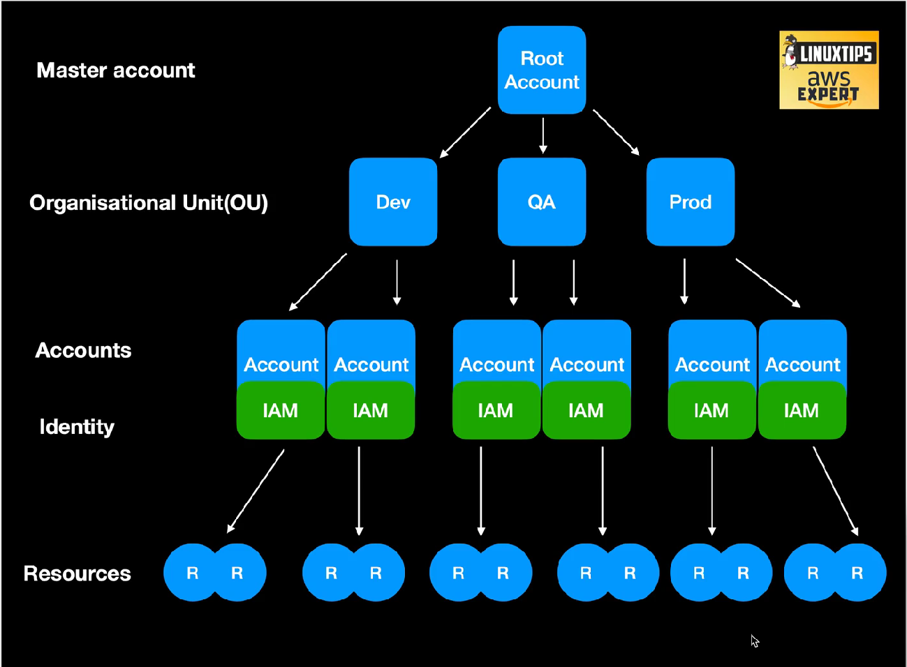
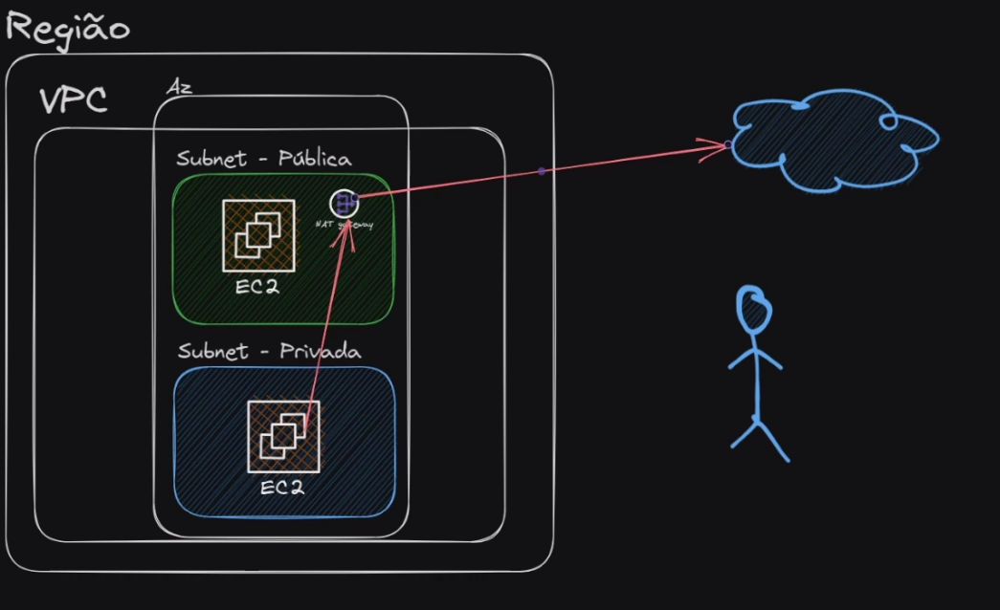

## Caracteristicas e Vantagens

- Agilidade
- Manutenção
- Confiabilidade
- Segurança
- Performance
- Escalabilidade
- Elasticidade


## Distribuição da AWS no Mundo

- Região
- Zona de Disponibilidade
- Zona local

## IAM (Identity & Access Management)

- **Policy**: Objeto que define os acesso aos recursos a AWS
```json
{
	"Version": "2012-10-17",
	"Statement": [
		{
			"Sid": "Statement1",
			"Effect": "Allow",
			"Action": [],
			"Resource": ["ARN"]
		}
	]
}
```
- **ARN - Amazon Resource Names**
    - arn:partition:service:region:account-id:resource-id
    - arn:partition:service:region:account-id:resource-type/resource-id
    - arn:partition:service:region:account-id:resource-type:resource-id

    - **parition**: representa em qual grupo de região a conta pertence
    - **servie**: nome do serviço que identifica o produto da AWS
    - **regiao**: cod da região
    - **account-id**: id da sua conta
    - **resource-id**: id do recurso


- **Group**: Cada grupo vai ter suas politicas de uso, facilitando agrupar e gerencias accounts e acesso.
- **Role**: Podemos permitir acesso entre serviços da aws utilizando a role


### Modelos de Serviços Resumo

- **Iaas (infrastructure as a service)**: É a disponibilidade sob demanda de recursos de computação altamente escalonáveis como serviços na Internet

- **SaaS (Software as a Service)**: Fornece aplicativos de software pela internet, eliminando a necessidade de instalação e manutenção local. Exemplos incluem Google Workspace e Microsoft Office 365.

- **PaaS (Platform as a Service)**: Oferece uma plataforma que permite aos clientes desenvolver, executar e gerenciar aplicativos sem lidar com a infraestrutura subjacente. Exemplos incluem Google App Engine e Microsoft Azure.

- **FaaS (Function as a Service)**: Permite que os usuários implantem funções ou pedaços de código que são executados em resposta a eventos, sem gerenciar servidores. Exemplos incluem AWS Lambda e Google Cloud Functions.

### Modelos de Implementação Resumo

- **Private Cloud (Nuvem Privada)**: Infraestrutura de nuvem exclusiva para uma única organização, oferecendo maior controle e segurança. Exemplos incluem data centers internos de empresas.

- **Public Cloud (Nuvem Pública)**: Serviços de nuvem fornecidos por terceiros e disponibilizados ao público pela internet. Exemplos incluem Amazon Web Services (AWS) e Google Cloud Platform (GCP).

- **Hybrid Cloud (Nuvem Híbrida)**: Combinação de nuvem privada e pública, permitindo que dados e aplicativos sejam compartilhados entre elas. Exemplos incluem a integração de data centers privados com serviços de nuvem pública.

- **Community Cloud (Nuvem Comunitária)**: Infraestrutura de nuvem compartilhada por várias organizações com interesses comuns, como requisitos de segurança ou conformidade. Exemplos incluem nuvens comunitárias para instituições governamentais ou educacionais.


## Foundation

### Master account
- Um dos problemas iniciais na criação de uma conta para subir seus projetos é a organização. Uma ideia é ter uma "root account" que gerenciará todas as demais contas.
- Conta com e-mail único.
### Organizational Unit(OU)
Podemos fazer o controle de recursos com base na organization. Por exemplo:
- Dev: utiliza apenas maquinas mais fracas, só pode usar servidores de São Paulo.

### Accounts
- Em uma conta de dev por exemplo crie um email para a equipe e não use email pessoais.


## EC2 - Elastic Compute Cloud
- Permite a criação de máquinas Windows, Linux e Mac
- Cobrança por segundo
- Pode ter acesso público ou não
- **Uso geral**: aplicação web
- **Otimizadas para computação**: aplicações que usam mais CPU
- **Otimmizada para memória**: banco redis
- **Computação acelerada**:  aplicações com calculos
- **Otimizadas pra armazenamento**: banco de dados
- **Otimizadas para alta performance**:  aplicações que fazem simulações e utilizam placa de video


## Principais Funcionalidades e Utilizações de uma VPC:


1. **Isolamento e Segurança**: A VPC oferece um ambiente isolado onde os recursos são protegidos do acesso externo não autorizado. Você pode definir regras de firewall (conhecidas como regras de segurança) e políticas de controle de acesso para controlar o tráfego de entrada e saída.

2. **Sub-redes**: Dentro de uma VPC, você pode criar sub-redes públicas e privadas. Sub-redes públicas têm acesso à internet, enquanto sub-redes privadas são usadas para recursos que não precisam de acesso direto à internet.

3. **Endereçamento IP**: Você pode definir faixas de endereços IP (CIDR blocks) para a VPC e suas sub-redes, permitindo a organização e gestão eficiente dos endereços IP.

4. **Internet Gateway**: Um Internet Gateway é um componente que permite que instâncias em sub-redes públicas se comuniquem com a internet. Ele age como um ponto de entrada e saída para o tráfego de rede da VPC. Ao anexar um Internet Gateway à sua VPC e configurar as rotas adequadas, você pode permitir que instâncias em sub-redes públicas acessem a internet.

5. **NAT Gateway**: Um NAT Gateway é usado para permitir que instâncias em sub-redes privadas acessem a internet enquanto permanecem inacessíveis da internet. Ele faz isso traduzindo os endereços IP privados para endereços IP públicos quando o tráfego sai da VPC. Isso é útil para instâncias que precisam acessar a internet para atualizações ou downloads, mas não precisam ser acessíveis externamente.

6. **Tabela de Rotas**: Uma tabela de rotas define como o tráfego de rede é direcionado dentro da VPC. Cada sub-rede é associada a uma tabela de rotas que determina para onde o tráfego deve ser enviado com base nos endereços IP de destino. As rotas podem ser configuradas para direcionar o tráfego para um Internet Gateway, NAT Gateway, outras sub-redes dentro da VPC ou mesmo conexões VPN para redes on-premises.

A0348